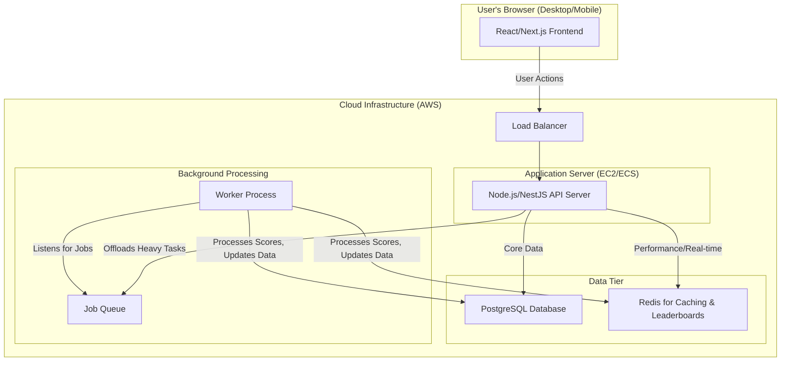

# **Project Review: Fantasy Cricket Technical Architecture Summary**

**Document Purpose:** This summary provides a high-level overview of the proposed technical architecture for the Fantasy Cricket web application. It is intended for review by Product, Business, and Engineering stakeholders to ensure alignment on the technical direction before development begins.

**Date:** October 26, 2023
**Status:** FOR REVIEW

---

### **1. Executive Summary & Core Architectural Decision**

We are building a modern, scalable, and engaging Fantasy Cricket platform. To balance speed-to-market with long-term flexibility, we have chosen a **Modular Monolith** architecture.

*   **What this means:** The application will be built as a single, cohesive unit, which is faster to develop and deploy initially.
*   **Why this is the right choice:**
    *   **Speed:** It simplifies development, allowing us to launch the core product faster.
    *   **Future-Proof:** The internal code will be strictly organized into independent modules (Users, Leagues, etc.). This design allows us to easily separate parts of the application into independent microservices later if scale demands it, without a complete rewrite.

---

### **2. High-Level System Design**

The system is composed of a modern web frontend that communicates with a backend application server, supported by a database, a caching layer for performance, and a background processing system for heavy tasks.

---

### **3. System Modules & Functionality**

The application is broken down into four primary modules that deliver the core user experience:

*   **User & Social Module:** Handles user registration, login, profile management, and the friends system. Authentication will be handled securely using industry-standard JSON Web Tokens (JWT).

*   **Team & Transfers Module:** The core gameplay loop. Users can view players, create their 15-player fantasy team while adhering to budget and composition rules, and make weekly transfers. All team creation and transfer logic is validated on the backend within a database transaction to ensure data integrity.

*   **Leagues & Leaderboards Module:** Manages user competition. Users can create and join public or private leagues. To deliver a compelling, real-time experience, leaderboards will be powered by a high-speed in-memory database (**Redis**) and updated instantly via WebSockets, ensuring users see score changes as they happen.

*   **Scoring & Game Admin Module:** The engine of the game. An admin panel allows for entering real-world match statistics. This action triggers a **background job** that calculates fantasy points for every player and updates all relevant user scores and leaderboards. This asynchronous approach ensures the main application remains fast and responsive for users, even during periods of heavy score calculation.

---

### **4. REVIEW CHECKPOINT: Instructions & Request for Feedback**

Please review the architecture and design choices above. We are seeking your feedback to confirm we are on the right track before we begin implementation sprints.

**Please focus your review on the following questions:**

1.  **Business Alignment:** Does the proposed architecture (Modular Monolith) align with our primary goal of a fast initial launch while keeping future options open?
2.  **Feature Completeness:** Do the defined modules cover the essential features outlined in the business requirements? Is anything obviously missing from a user-experience perspective?
3.  **Performance & User Experience:** Does the plan for real-time leaderboards (using Redis & WebSockets) and background score processing meet your expectations for a modern, responsive application?
4.  **Risks & Concerns:** Are there any potential risks, complexities, or dependencies that you feel are underestimated in this plan?

**Please provide your feedback by [Date] via [Method, e.g., comments in this document, email, scheduled meeting].**